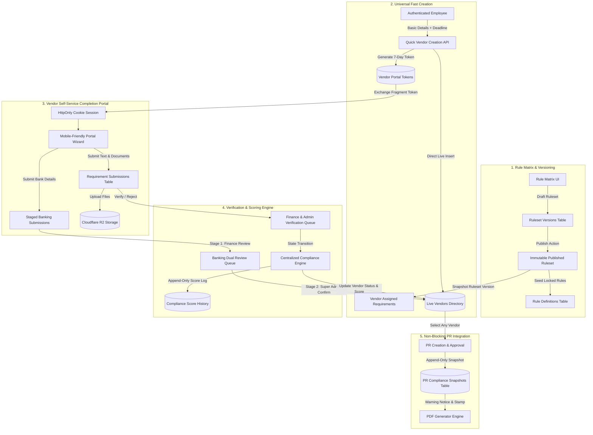
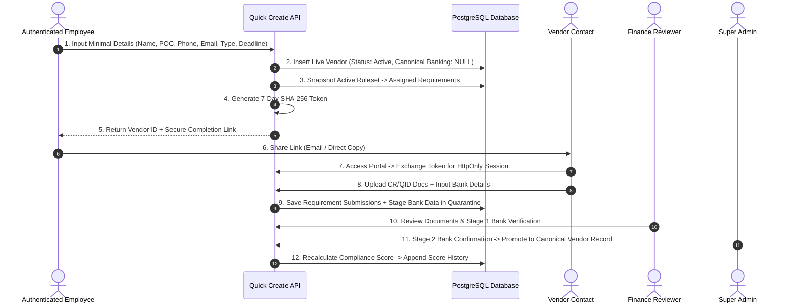
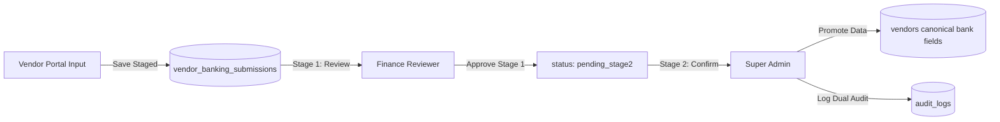
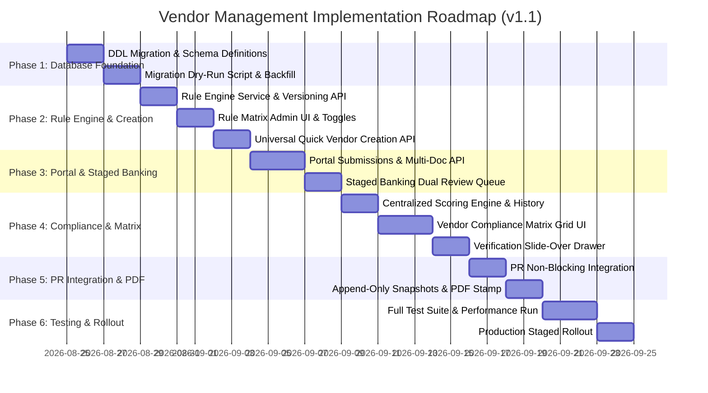

# PurchaseTracker Vendor Management Redesign
## Feasibility Review and Technical Implementation Plan (Version 1.1.0-REVISED)

**Document Version:** 1.1.0-REVISED  
**Author:** Antigravity AI Engineering Assistant  
**Date:** August 21, 2026  
**Status:** **AWAITING EXPLICIT WRITTEN APPROVAL (NO APPLICATION CODE OR DATA MODIFIED)**  
**Target Codebase:** PurchaseTracker (`b:\PurchaseTracker\PurchaseTracker`)

---

## Table of Contents

1. [A. Executive Verdict](#a-executive-verdict)
2. [B. Current-State Findings](#b-current-state-findings)
3. [C. Requirement-by-Requirement Feasibility Matrix](#c-requirement-by-requirement-feasibility-matrix)
4. [D. Architectural Decisions, Staged Staging & Assumptions](#d-architectural-decisions-staged-staging--assumptions)
5. [E. Proposed End-to-End System Architecture](#e-proposed-end-to-end-system-architecture)
6. [F. Comprehensive Database Plan & Schema Design](#f-comprehensive-database-plan--schema-design)
7. [G. Simplified Vendor Rule Matrix & Versioning Specification](#g-simplified-vendor-rule-matrix--versioning-specification)
8. [H. Vendor Compliance Matrix Specification & Performance Engineering](#h-vendor-compliance-matrix-specification--performance-engineering)
9. [I. Vendor Lifecycle & Token Security Model](#i-vendor-lifecycle--token-security-model)
10. [J. Multi-Dimensional Compliance Status & Weighted Scoring Formula](#j-multi-dimensional-compliance-status--weighted-scoring-formula)
11. [K. Security, Roles, Banking Staging & Privacy](#k-security-roles-banking-staging--privacy)
12. [L. Purchase Request Non-Blocking Integration & Immutable Snapshots](#l-purchase-request-non-blocking-integration--immutable-snapshots)
13. [M. Legacy Data Migration, Dry-Run & Non-Destructive Rollback](#m-legacy-data-migration-dry-run--non-destructive-rollback)
14. [N. Feature Flags & Staged Rollout Strategy](#n-feature-flags--staged-rollout-strategy)
15. [O. Phased Implementation Roadmap](#o-phased-implementation-roadmap)
16. [P. Comprehensive Test Suite & Acceptance Benchmarks](#p-comprehensive-test-suite--acceptance-benchmarks)
17. [Q. Risk Register & Mitigation Matrix](#q-risk-register--mitigation-matrix)
18. [R. Complete Change Inventory](#r-complete-change-inventory)
19. [S. Answers to 20 Feasibility Review Questions](#s-answers-to-20-feasibility-review-questions)
20. [T. Approval Checklist](#t-approval-checklist)

---

## A. Executive Verdict

### **VERDICT: Feasible, but requires structural refactoring and staged migration.**

### Executive Justification
The vendor management redesign is structurally sound, strategically necessary, and fully feasible within the PostgreSQL / Drizzle ORM / Next.js architecture of PurchaseTracker. However, executing this safely without corrupting historical procurement data or disrupting live purchase requests requires **structural refactoring** across four major domains and a **staged, feature-flagged migration**:

1. **Entity Decoupling:** Separating *assigned requirements* (what is requested) from *requirement submissions* (what was submitted, versioned, and verified), rather than overloading single foreign keys.
2. **Multi-Dimensional State Engine:** Decoupling *Submission Status*, *Validity Status*, and *Deadline Status* into independent, orthogonal dimensions rather than collapsing complex states into a single enum.
3. **True Immutable Snapshots & Append-Only Auditing:** Introducing dedicated append-only tables for PR compliance snapshots (`purchase_request_compliance_snapshots`) and vendor compliance score history (`vendor_compliance_score_history`).
4. **Staged Banking Dual-Control:** Ensuring portal-submitted bank data is staged into a quarantine state (`vendor_banking_submissions`) requiring Stage 1 Finance verification and Stage 2 Super Admin confirmation before mutating canonical payable fields.
5. **Non-Destructive Legacy Backfill:** Executing a phased migration with pre-flight dry-run reporting, bulk legacy deadline assignment, and zero destructive column alterations.

---

## B. Current-State Findings

A comprehensive inspection of the existing codebase revealed the following file locations, logic, and operational behaviors:

### 1. Database Schema (`db/schema.ts`)
* **`vendors` (Lines 200–230):** Stores vendor master records. Currently has `bankName`, `accountNumber`, `ibanNumber`, and `branchName` configured as `notNull()` in Drizzle, which currently forces all vendor creation methods to provide banking details upfront. Contains `vendorType` ('company' | 'freelancer' | etc.), `complianceStatus` ('legacy_pending_assessment' | 'unassessed' | 'compliant' | 'expiring_soon' | 'non_compliant' | 'grace_period'), `complianceScore` (0–100), `gracePeriodDeadline`, and `complianceMetadata` (JSONB).
* **`vendorComplianceSettings` (Lines 278–290):** Singleton table storing `companyChecklist` (array of strings default `["CR", "TAX_CARD", "ESTABLISHMENT_ID"]`) and `freelancerChecklist` (empty array). Lacks granular rule definitions, input types, and versioning.
* **`vendorOnboardingDrafts` (Lines 291–327):** Staging table for invited vendors. Vendors created via self-service invite remain trapped in `invited`, `in_progress`, or `submitted` status and **cannot be selected in PRs** until an Admin manually approves them via `approveAndPromoteDraft()`.
* **`vendorOnboardingTokens` (Lines 328–350):** Stores SHA-256 token hashes, `draftId`, `vendorId`, `caseId`, `status` ('active' | 'submitted' | 'expired' | 'revoked' | 'used'), and strict 24-hour expiration timestamps.
* **`vendorDocuments` (Lines 417–439):** Stores document records with `documentType`, `documentName`, `fileUrl`, `reviewStatus` ('pending_review' | 'approved' | 'rejected'), and `expiryDate`.
* **`vendorComplianceCases` (Lines 231–256) & `vendorComplianceOverrides` (Lines 257–277):** Stores formal review cases and PR-bound compliance overrides.
* **`vendorChangeRequests` (Lines 372–392):** Staging table for vendor profile changes and banking dual-review.

### 2. Vendor Creation & Gating Logic
* **Direct Vendor Creation (`src/app/api/vendors/route.ts`):** `POST /api/vendors` requires `admin`, `super_admin`, or `canManageVendors=true` to create an `active` vendor. Non-admin users create `pending` vendors that are invisible to procurement.
* **Invite / Draft Flow (`src/lib/services/VendorOnboardingService.ts`):** `createDraftAndInvitation()` inserts into `vendorOnboardingDrafts` and generates a 24-hour link. The vendor cannot be selected for any PR until promoted.
* **Draft Promotion (`VendorOnboardingService.ts` Lines 940–1300):** Executes an atomic lock (`FOR UPDATE`), verifies mandatory documents, stages the vendor into `vendors` table, triggers a compliance scan, and activates the vendor.

### 3. PR Compliance Hard Stops
* **Backend Gatekeeper (`src/lib/core/compliance.ts` Lines 18–85):** `evaluateCompliance()` returns `{ isBlocked: true }` if vendor status is not active, if score $< 50$, or if any document is expired $> 30$ days (unless a Super Admin override exists).
* **PR Creation Route (`src/app/api/requests/route.ts` Lines 322–333):** `POST /api/requests` rejects non-draft submissions with HTTP 403 (`"Access Denied: Compliance Violation"`) if `evaluateCompliance()` returns `isBlocked: true`.
* **PR Update Route (`src/app/api/requests/[id]/route.ts` Lines 388–404):** `PATCH /api/requests/[id]` rejects status transitions to `pending` with HTTP 403 if `isBlocked: true`.
* **Frontend Modal (`src/components/requests/CreateRequestModal.tsx`):** Lines 176, 649–670 calculate `isNonCompliant = score < 50` and display a red banner; Line 1184 disables the submit button (`disabled={isSubmitting || !!isNonCompliant}`); Lines 1189–1205 render "Access Denied" with `ShieldAlert`.

### 4. Banking Dual-Control Security (`src/lib/services/VendorBankingSecurityService.ts`)
* Masks IBAN and Account Number for standard users.
* Routes banking updates through a 2-stage approval: Stage 1 = Finance Verification (`status: 'finance_approved'`), Stage 2 = Super Admin Final Confirmation (`status: 'approved'`).
* Applies banking changes to `vendors` record only after Stage 2 completion.

---

## C. Requirement-by-Requirement Feasibility Matrix

| # | Requirement | Feasible | Existing Architecture Support | Required Changes | Risk | Architectural Recommendation |
| :--- | :--- | :---: | :--- | :--- | :---: | :--- |
| **1** | **Universal Minimal Creation** | **YES** | `POST /api/vendors` exists. | Make bank/tax fields nullable; allow any authenticated user to create live active vendor with minimal fields. | Very Low | Implement quick-create endpoint returning vendor ID and token immediately. |
| **2** | **Separation of Requirements vs Submissions** | **YES** | Single `vendorDocuments` table. | Create `vendor_assigned_requirements` (definitions/rules) and `vendor_requirement_submissions` (responses/history). | Medium | Support typed fields, multi-document uploads, replacement history, and versioning. |
| **3** | **Separation of Status Dimensions** | **YES** | Single string `complianceStatus`. | Deconstruct into: (1) Submission Status, (2) Validity Status, (3) Deadline Status. | Medium | Model orthogonal states cleanly to prevent contradictory state bugs (e.g. submitted + overdue). |
| **4** | **Entity & Engagement Types** | **YES** | `vendorType` exists. | Add `engagementType` ('temporary' \| 'permanent') to `vendors`. | Low | Never auto-downgrade permanent to temporary based on missing documents. |
| **5** | **Locked Core Requirements** | **YES** | Hardcoded checks exist. | Seed immutable rows in `vendor_rules`: Company CR (Locked), Freelancer QID (Locked). | Low | Enforce lock in API and UI; prevent deletion or making optional. |
| **6** | **Immutable Rule Versioning** | **YES** | Singleton settings currently. | Create `vendor_ruleset_versions` table. Defaults to `draft`. Exactly one active published version. | Medium | Assigned requirements snapshot ruleset version ID and configuration snapshot. |
| **7** | **Staged Initial Banking** | **YES** | Dual-control exists in service. | Portal bank submissions write to `vendor_banking_submissions` staging table. | Low | Stage 1 Finance + Stage 2 Super Admin before promoting to canonical vendor record. Incomplete bank details affect score only. |
| **8** | **Token Expiry vs Deadline Separation** | **YES** | 24-hour token in schema. | Portal token expires in 7 days (configurable); compliance deadline is 7/14/30 days. | Low | Link regeneration refreshes token without altering vendor compliance deadline or creation date. |
| **9** | **Append-Only PR Snapshots** | **YES** | No snapshot table currently. | Create `purchase_request_compliance_snapshots` table for immutable audit on every submission/resubmission. | Low | PR retains `latest_compliance_snapshot_id` foreign key for query performance. |
| **10**| **Non-Blocking PR Integration** | **YES** | Blockers exist in routes/UI. | Remove HTTP 403 stops; capture snapshot; display informational warnings & badges. | Very Low | Vendors remain selectable and submittable in PRs regardless of compliance score. |
| **11**| **Append-Only Score History** | **YES** | Score updated in-place. | Create `vendor_compliance_score_history` table logging every calculation breakdown and triggering event. | Low | Provides full audit trail on vendor detail page. |
| **12**| **Dynamic Compliance Matrix** | **YES** | Basic list view exists. | Build full spreadsheet-style matrix table with sticky columns and dynamic requirement columns. | Medium | Server-side pagination (50/page) with batch-loaded relations for high throughput. |
| **13**| **PDF Notice Stamp** | **YES** | `RequestPdfGenerator.ts`. | Render prominent compliance notice stamp box on page 1 for non-compliant/pending vendors. | Low | Draw visual warning box with score, vendor age, and overdue missing items using `pdf-lib`. |
| **14**| **Duplicate Detection** | **YES** | `checkDuplicates()` exists. | Integrate duplicate check into quick-create modal (warn, don't block). Enforce verified CR/QID uniqueness. | Low | Display match drawer with link to existing record. Disallow duplicate verified CR/QID. |

---

## D. Architectural Decisions, Staged Staging & Assumptions

### 1. Architectural Decisions

* **AD-1: Requirement vs. Submission Decoupling:**  
  `vendor_assigned_requirements` describes *what* the vendor is obligated to provide (rule definition, mandatory flag, score weight, instructions, resolved due date, snapshot of ruleset version).  
  `vendor_requirement_submissions` captures *what* was submitted (version number, text values, document attachments, replacement history, verification state, reviewer identity, rejection rationale).
* **AD-2: Multi-Dimensional Status Derivation:**  
  Status is no longer stored as a single ambiguous string. Three orthogonal dimensions are maintained:
  * **Submission Status:** `missing` | `draft` | `submitted` | `under_review` | `verified` | `rejected`
  * **Validity Status:** `valid` | `expiring_soon` | `expired` | `not_applicable`
  * **Deadline Status:** `due` | `overdue` | `completed_on_time` | `completed_late`
* **AD-3: Staged Initial Banking Verification:**  
  First-time vendor banking submissions do not touch the canonical `bank_name`, `account_number`, or `iban_number` columns on `vendors`. They are written to `vendor_banking_submissions` with status `pending_finance_review`. Only after Stage 1 Finance verification and Stage 2 Super Admin confirmation are canonical payable fields populated. Incomplete banking affects score only and never blocks PRs.
* **AD-4: Ruleset Publication & Immutability:**  
  New ruleset versions default to `draft`. Exactly one ruleset version can have `status = 'published'`. When a ruleset is published, its definition array is frozen in `rules_snapshot` (JSONB) and marked read-only.
* **AD-5: Token Security & Deadline Decoupling:**  
  Bearer tokens expire after 7 days by default. Compliance deadlines (7, 14, 30 days) dictate compliance status (`due` vs `overdue`). Link regeneration creates a fresh 7-day token without resetting the vendor's compliance deadline or creation date.
* **AD-6: Append-Only PR Compliance Snapshots:**  
  Every PR submission, resubmission, or stage approval logs a row into `purchase_request_compliance_snapshots`, guaranteeing that historical PR compliance posture remains frozen in time.

---

## E. Proposed End-to-End System Architecture



---

## F. Comprehensive Database Plan & Schema Design

### 1. DDL Specification

```sql
-- ============================================================================
-- MIGRATION: 0005_vendor_management_redesign_v1_1.sql
-- PURPOSE: Complete Vendor Management Redesign with Decoupled Submissions,
--          Multi-Dimensional Status, Append-Only Auditing & Staged Banking.
-- ============================================================================

BEGIN;

-- 1. Ruleset Versions Table (Immutable Published Snapshots)
CREATE TABLE IF NOT EXISTS "vendor_ruleset_versions" (
  "id" serial PRIMARY KEY,
  "version_number" integer NOT NULL UNIQUE,
  "status" text NOT NULL DEFAULT 'draft', -- 'draft', 'published', 'archived'
  "rules_snapshot" jsonb NOT NULL DEFAULT '[]'::jsonb,
  "published_by" integer REFERENCES "users"("id") ON DELETE SET NULL,
  "published_at" timestamp with time zone,
  "change_summary" text,
  "created_at" timestamp with time zone NOT NULL DEFAULT NOW()
);
CREATE INDEX "idx_ruleset_versions_status" ON "vendor_ruleset_versions"("status");

-- 2. Rule Definitions Table (Global Configurable Catalog)
CREATE TABLE IF NOT EXISTS "vendor_rule_definitions" (
  "id" serial PRIMARY KEY,
  "rule_key" text NOT NULL UNIQUE, -- 'cr_document', 'qid_document', 'tax_card', 'bank_details', etc.
  "name" text NOT NULL,
  "section" text NOT NULL DEFAULT 'legal', -- 'basic', 'legal', 'finance', 'document', 'contract', 'other'
  "description" text,
  "instructions" text,
  "input_type" text NOT NULL DEFAULT 'document', -- 'short_text', 'long_text', 'number', 'currency', 'date', 'email', 'mobile', 'dropdown', 'checkbox', 'document', 'field_and_document'
  "dropdown_options" jsonb DEFAULT '[]'::jsonb,
  "is_active" boolean NOT NULL DEFAULT true,
  "is_locked" boolean NOT NULL DEFAULT false, -- True for Company CR & Freelancer QID
  "display_order" integer NOT NULL DEFAULT 0,
  
  -- Company Configuration
  "company_applicable" boolean NOT NULL DEFAULT true,
  "company_mandatory" boolean NOT NULL DEFAULT false,
  "company_creator_can_change" boolean NOT NULL DEFAULT false,
  "company_affects_score" boolean NOT NULL DEFAULT true,
  "company_info_required" boolean NOT NULL DEFAULT false,
  "company_doc_required" boolean NOT NULL DEFAULT true,

  -- Freelancer Configuration
  "freelancer_applicable" boolean NOT NULL DEFAULT false,
  "freelancer_mandatory" boolean NOT NULL DEFAULT false,
  "freelancer_creator_can_change" boolean NOT NULL DEFAULT false,
  "freelancer_affects_score" boolean NOT NULL DEFAULT true,
  "freelancer_info_required" boolean NOT NULL DEFAULT false,
  "freelancer_doc_required" boolean NOT NULL DEFAULT true,

  -- Document & Verification Rules
  "expiry_required" boolean NOT NULL DEFAULT false,
  "verification_required" boolean NOT NULL DEFAULT true,
  "verification_role" text NOT NULL DEFAULT 'finance', -- 'finance', 'admin', 'super_admin'
  "expiry_warning_days" integer NOT NULL DEFAULT 30,
  "accepted_file_formats" jsonb NOT NULL DEFAULT '["pdf", "jpg", "jpeg", "png"]'::jsonb,
  "max_file_size_mb" integer NOT NULL DEFAULT 10,
  "score_weight" integer NOT NULL DEFAULT 10, -- Bounded between 1 and 100
  
  "created_at" timestamp with time zone NOT NULL DEFAULT NOW(),
  "updated_at" timestamp with time zone NOT NULL DEFAULT NOW()
);
CREATE INDEX "idx_rule_definitions_key" ON "vendor_rule_definitions"("rule_key");
CREATE INDEX "idx_rule_definitions_section" ON "vendor_rule_definitions"("section");

-- 3. Vendors Table Modifications (Nullable Bank Details for Fast Creation)
ALTER TABLE "vendors"
  ALTER COLUMN "bank_name" DROP NOT NULL,
  ALTER COLUMN "account_number" DROP NOT NULL,
  ALTER COLUMN "iban_number" DROP NOT NULL,
  ALTER COLUMN "branch_name" DROP NOT NULL,
  ADD COLUMN IF NOT EXISTS "engagement_type" text NOT NULL DEFAULT 'permanent',
  ADD COLUMN IF NOT EXISTS "compliance_deadline" timestamp with time zone,
  ADD COLUMN IF NOT EXISTS "ruleset_version_id" integer REFERENCES "vendor_ruleset_versions"("id") ON DELETE SET NULL,
  ADD COLUMN IF NOT EXISTS "banking_verification_status" text NOT NULL DEFAULT 'unverified', -- 'unverified', 'pending_stage1', 'pending_stage2', 'verified'
  ADD COLUMN IF NOT EXISTS "requires_classification_review" boolean NOT NULL DEFAULT false,
  ADD COLUMN IF NOT EXISTS "creator_id" integer REFERENCES "users"("id") ON DELETE SET NULL;

CREATE INDEX IF NOT EXISTS "idx_vendors_engagement_type" ON "vendors"("engagement_type");
CREATE INDEX IF NOT EXISTS "idx_vendors_compliance_deadline" ON "vendors"("compliance_deadline");

-- 4. Vendor Assigned Requirements Table (Obligations Assigned to Vendor)
CREATE TABLE IF NOT EXISTS "vendor_assigned_requirements" (
  "id" serial PRIMARY KEY,
  "vendor_id" integer NOT NULL REFERENCES "vendors"("id") ON DELETE CASCADE,
  "rule_id" integer REFERENCES "vendor_rule_definitions"("id") ON DELETE SET NULL,
  "source_ruleset_version_id" integer NOT NULL REFERENCES "vendor_ruleset_versions"("id") ON DELETE RESTRICT,
  "rule_key" text NOT NULL,
  "name" text NOT NULL,
  "section" text NOT NULL,
  "input_type" text NOT NULL,
  "is_mandatory" boolean NOT NULL DEFAULT false,
  "is_custom" boolean NOT NULL DEFAULT false,
  "affects_score" boolean NOT NULL DEFAULT true,
  "score_weight" integer NOT NULL DEFAULT 10,
  "info_required" boolean NOT NULL DEFAULT false,
  "doc_required" boolean NOT NULL DEFAULT false,
  "expiry_required" boolean NOT NULL DEFAULT false,
  "verification_required" boolean NOT NULL DEFAULT true,
  "verification_role" text NOT NULL DEFAULT 'finance',
  "accepted_file_formats" jsonb NOT NULL DEFAULT '["pdf", "jpg", "jpeg", "png"]'::jsonb,
  "max_file_size_mb" integer NOT NULL DEFAULT 10,
  "dropdown_options" jsonb DEFAULT '[]'::jsonb,
  "instructions" text,
  "display_order" integer NOT NULL DEFAULT 0,
  "resolved_due_date" timestamp with time zone NOT NULL,
  
  -- Multi-Dimensional Current State
  "submission_status" text NOT NULL DEFAULT 'missing', -- 'missing', 'draft', 'submitted', 'under_review', 'verified', 'rejected'
  "validity_status" text NOT NULL DEFAULT 'not_applicable', -- 'valid', 'expiring_soon', 'expired', 'not_applicable'
  "deadline_status" text NOT NULL DEFAULT 'due', -- 'due', 'overdue', 'completed_on_time', 'completed_late'
  
  "created_by" integer REFERENCES "users"("id") ON DELETE SET NULL,
  "created_at" timestamp with time zone NOT NULL DEFAULT NOW(),
  "updated_at" timestamp with time zone NOT NULL DEFAULT NOW()
);
CREATE INDEX "idx_assigned_reqs_vendor" ON "vendor_assigned_requirements"("vendor_id");
CREATE INDEX "idx_assigned_reqs_submission" ON "vendor_assigned_requirements"("submission_status");
CREATE INDEX "idx_assigned_reqs_validity" ON "vendor_assigned_requirements"("validity_status");
CREATE INDEX "idx_assigned_reqs_deadline" ON "vendor_assigned_requirements"("deadline_status");

-- 5. Vendor Requirement Submissions Table (Decoupled Responses & Audit Trail)
CREATE TABLE IF NOT EXISTS "vendor_requirement_submissions" (
  "id" serial PRIMARY KEY,
  "assigned_requirement_id" integer NOT NULL REFERENCES "vendor_assigned_requirements"("id") ON DELETE CASCADE,
  "vendor_id" integer NOT NULL REFERENCES "vendors"("id") ON DELETE CASCADE,
  "version_number" integer NOT NULL DEFAULT 1,
  "field_value" text, -- Stored typed values (text, date, number, etc.)
  "document_ids" jsonb DEFAULT '[]'::jsonb, -- Array of vendor_documents IDs
  "expiry_date" timestamp with time zone,
  "submission_notes" text,
  
  -- Status & Verification
  "status" text NOT NULL DEFAULT 'submitted', -- 'draft', 'submitted', 'verified', 'rejected', 'superseded'
  "submitted_by_type" text NOT NULL DEFAULT 'vendor', -- 'vendor', 'user'
  "submitted_by_id" integer REFERENCES "users"("id") ON DELETE SET NULL,
  "submitted_at" timestamp with time zone NOT NULL DEFAULT NOW(),
  
  "verified_by" integer REFERENCES "users"("id") ON DELETE SET NULL,
  "verified_at" timestamp with time zone,
  "rejection_reason" text,
  "verification_notes" text,
  
  "created_at" timestamp with time zone NOT NULL DEFAULT NOW()
);
CREATE INDEX "idx_req_submissions_assigned" ON "vendor_requirement_submissions"("assigned_requirement_id");
CREATE INDEX "idx_req_submissions_vendor" ON "vendor_requirement_submissions"("vendor_id");
CREATE INDEX "idx_req_submissions_status" ON "vendor_requirement_submissions"("status");

-- 6. Staged Banking Submissions Table (Quarantine Dual-Control)
CREATE TABLE IF NOT EXISTS "vendor_banking_submissions" (
  "id" serial PRIMARY KEY,
  "vendor_id" integer NOT NULL REFERENCES "vendors"("id") ON DELETE CASCADE,
  "bank_name" text NOT NULL,
  "branch_name" text NOT NULL,
  "account_number" text NOT NULL,
  "iban_number" text NOT NULL,
  "payment_currency" text NOT NULL DEFAULT 'QAR',
  "bank_letter_doc_id" integer REFERENCES "vendor_documents"("id") ON DELETE SET NULL,
  "status" text NOT NULL DEFAULT 'pending_stage1', -- 'pending_stage1', 'pending_stage2', 'verified', 'rejected'
  
  -- Stage 1: Finance Verification
  "stage1_reviewed_by" integer REFERENCES "users"("id") ON DELETE SET NULL,
  "stage1_reviewed_at" timestamp with time zone,
  "stage1_notes" text,
  
  -- Stage 2: Super Admin Final Confirmation
  "stage2_reviewed_by" integer REFERENCES "users"("id") ON DELETE SET NULL,
  "stage2_reviewed_at" timestamp with time zone,
  "stage2_notes" text,
  
  "rejection_reason" text,
  "submitted_at" timestamp with time zone NOT NULL DEFAULT NOW(),
  "created_at" timestamp with time zone NOT NULL DEFAULT NOW()
);
CREATE INDEX "idx_banking_submissions_vendor" ON "vendor_banking_submissions"("vendor_id");
CREATE INDEX "idx_banking_submissions_status" ON "vendor_banking_submissions"("status");

-- 7. Append-Only PR Compliance Snapshots Table
CREATE TABLE IF NOT EXISTS "purchase_request_compliance_snapshots" (
  "id" serial PRIMARY KEY,
  "request_id" integer NOT NULL REFERENCES "purchase_requests"("id") ON DELETE CASCADE,
  "vendor_id" integer NOT NULL REFERENCES "vendors"("id") ON DELETE RESTRICT,
  "event_type" text NOT NULL DEFAULT 'submission', -- 'submission', 'resubmission', 'approval_step'
  "compliance_score" integer NOT NULL,
  "compliance_status" text NOT NULL,
  "vendor_age_days" integer NOT NULL,
  "compliance_deadline" timestamp with time zone,
  "is_overdue" boolean NOT NULL DEFAULT false,
  "overdue_days" integer NOT NULL DEFAULT 0,
  "missing_mandatory_keys" jsonb NOT NULL DEFAULT '[]'::jsonb,
  "expired_requirement_keys" jsonb NOT NULL DEFAULT '[]'::jsonb,
  "ruleset_version_id" integer REFERENCES "vendor_ruleset_versions"("id") ON DELETE SET NULL,
  "raw_snapshot_data" jsonb NOT NULL,
  "triggered_by" integer REFERENCES "users"("id") ON DELETE SET NULL,
  "created_at" timestamp with time zone NOT NULL DEFAULT NOW()
);
CREATE INDEX "idx_pr_snapshots_request" ON "purchase_request_compliance_snapshots"("request_id");
CREATE INDEX "idx_pr_snapshots_vendor" ON "purchase_request_compliance_snapshots"("vendor_id");

-- 8. Append-Only Compliance Score History Table
CREATE TABLE IF NOT EXISTS "vendor_compliance_score_history" (
  "id" serial PRIMARY KEY,
  "vendor_id" integer NOT NULL REFERENCES "vendors"("id") ON DELETE CASCADE,
  "previous_score" integer NOT NULL,
  "new_score" integer NOT NULL,
  "previous_status" text NOT NULL,
  "new_status" text NOT NULL,
  "calculation_breakdown" jsonb NOT NULL,
  "triggering_event" text NOT NULL, -- 'INITIAL_CREATION', 'SUBMISSION_VERIFIED', 'SUBMISSION_REJECTED', 'DOCUMENT_EXPIRED', 'DEADLINE_PASSED', 'RULESET_REAPPLIED'
  "ruleset_version_id" integer REFERENCES "vendor_ruleset_versions"("id") ON DELETE SET NULL,
  "recalculated_by" integer REFERENCES "users"("id") ON DELETE SET NULL,
  "created_at" timestamp with time zone NOT NULL DEFAULT NOW()
);
CREATE INDEX "idx_score_history_vendor" ON "vendor_compliance_score_history"("vendor_id");

-- 9. Vendor Portal Events Table (Link Tracking)
CREATE TABLE IF NOT EXISTS "vendor_portal_events" (
  "id" serial PRIMARY KEY,
  "vendor_id" integer NOT NULL REFERENCES "vendors"("id") ON DELETE CASCADE,
  "token_id" integer REFERENCES "vendor_onboarding_tokens"("id") ON DELETE SET NULL,
  "event_type" text NOT NULL, -- 'LINK_GENERATED', 'LINK_COPIED', 'LINK_SENT_EMAIL', 'PORTAL_OPENED', 'DRAFT_SAVED', 'PORTAL_SUBMITTED', 'REMINDER_SENT'
  "actor_id" integer REFERENCES "users"("id") ON DELETE SET NULL,
  "actor_type" text NOT NULL DEFAULT 'user', -- 'user', 'vendor', 'system'
  "metadata" jsonb DEFAULT '{}'::jsonb,
  "created_at" timestamp with time zone NOT NULL DEFAULT NOW()
);
CREATE INDEX "idx_portal_events_vendor" ON "vendor_portal_events"("vendor_id");

COMMIT;
```

---

## G. Simplified Vendor Rule Matrix & Versioning Specification

### 1. Spreadsheet Controls & Toggle Dependencies

```
+-----------------------------------------------------------------------------------------------------------------------------------------------+
| ID | Requirement Name | Section | Input Type | Active | Company App | Co. Mand | Co. Score | Freelancer App | Free. Mand | Free. Score | Expiry Req | Verif Req | Locked | Actions |
+-----------------------------------------------------------------------------------------------------------------------------------------------+
| 1  | Commercial Reg.  | Legal   | Document   | [YES]  | [YES]       | [YES]    | [YES]     | [NO]           | [NO]       | [NO]        | [YES]      | [YES]     | [LOCKED]| [Edit]  |
| 2  | Qatar ID (QID)   | Legal   | Document   | [YES]  | [NO]        | [NO]     | [NO]      | [YES]          | [YES]      | [YES]       | [YES]      | [YES]     | [LOCKED]| [Edit]  |
| 3  | Tax Card / TIN   | Finance | Document   | [YES]  | [YES]       | [NO]     | [YES]     | [YES]          | [NO]       | [YES]       | [NO]       | [YES]     | [NO]   | [Edit]  |
| 4  | Bank Details     | Finance | Field+Doc  | [YES]  | [YES]       | [NO]     | [YES]     | [YES]          | [NO]       | [YES]       | [NO]       | [YES]     | [NO]   | [Edit]  |
| 5  | Master Contract  | Contract| Document   | [YES]  | [YES]       | [NO]     | [NO]      | [NO]           | [NO]       | [NO]        | [YES]      | [YES]     | [NO]   | [Edit]  |
+-----------------------------------------------------------------------------------------------------------------------------------------------+
```

### 2. Dependency Rules & Automatic Validation
1. **Applicability Cascade:** `Applicable = NO` forces and disables `Mandatory = NO`, `Affects Score = NO`, `Info Required = NO`, and `Doc Required = NO`.
2. **Mandatory Cascade:** `Mandatory = YES` automatically forces and locks `Affects Score = YES`.
3. **Document Cascade:** `Doc Required = NO` forces and disables `Expiry Required = NO`.
4. **Expiry Dependency:** `Expiry Required = YES` forces and locks `Doc Required = YES`.
5. **System Locks:** Rules with `is_locked = true` (Company CR and Freelancer QID) cannot be deleted, made inapplicable, or switched to optional.
6. **Advanced Settings Drawer:** Rule weights (1–100), accepted file formats, max file sizes, and custom instructions reside in an expandable drawer to keep the primary matrix interface clean and responsive.

### 3. Ruleset Publication & Immutability Lifecycle
1. **Creation:** Super Admin creates or duplicates a ruleset, initialized as `status = 'draft'`.
2. **Impact Preview Simulation:** Before publishing, Super Admin triggers `/api/admin/rules/preview-impact`. The engine runs an in-memory simulation against all active vendors and outputs:
   * Total vendors affected
   * Vendors gaining compliance score ($+\Delta$)
   * Vendors losing compliance score ($-\Delta$)
   * Vendors shifting to `Pending` or `Non-Compliant`
3. **Publication:** Publishing archives the currently active ruleset (`status = 'archived'`), marks the new ruleset `status = 'published'`, writes the frozen JSON snapshot to `rules_snapshot`, and locks the record against future edits.
4. **Non-Destructive Reversion:** If a ruleset publication must be rolled back, the previous ruleset version is re-promoted to `published`. Assigned requirements are updated transactionally without deleting any vendor submissions.

---

## H. Vendor Compliance Matrix Specification & Performance Engineering

### 1. Grid Architecture & Sticky Layout
* **Sticky Identity Columns (Left):**
  1. Vendor ID & Name
  2. Entity Type (`Company` | `Freelancer`)
  3. Engagement Type (`Temporary` | `Permanent`)
  4. Overall Compliance Status Badge (`Compliant`, `Pending`, `Under Review`, `Expiring Soon`, `Non-Compliant`)
  5. Compliance Score Pill (0–100%)
  6. Deadline Tracker (`Due in 5d` / `Overdue 3d`)
* **Scrollable Dynamic Columns (One per Published Rule):**
  * Displays multi-dimensional cell status badges:
    * `Missing` (Gray)
    * `Draft` (Slate)
    * `Under Review` (Amber pulse)
    * `Verified` (Emerald)
    * `Expiring Soon` (Amber warning with countdown)
    * `Expired` (Red)
    * `Rejected` (Red with review note indicator)
    * `N/A` (Muted)
* **Sticky Action Column (Right):**
  * Quick link generation & copy button
  * Open verification drawer button

### 2. Performance Engineering & Benchmarking
* **Volume Baseline:** 2,000 active vendors $\times$ 20 active rules $= 40,000$ assigned requirement records.
* **Query Optimization:**
  * Strict server-side pagination (default 50 rows per page).
  * Two-phase query execution: Phase 1 selects paginated vendor IDs; Phase 2 batch-loads all `vendor_assigned_requirements` for those 50 vendor IDs in a single indexed query (`WHERE vendor_id IN (...)`).
  * Indices on `(vendor_id, submission_status)`, `(vendor_id, validity_status)`, and `(vendor_id, deadline_status)` prevent full-table scans.
* **Frontend Rendering:**
  * Native CSS sticky positioning (`position: sticky; left: 0; z-index: 20`) eliminates virtualization overhead for standard viewport widths.
  * Maximum 15 dynamic columns rendered simultaneously with column visibility picker.
* **Performance Benchmark Threshold:** Page 1 response time $< 300\text{ms}$ (p95) on a 5,000-vendor benchmark dataset.

---

## I. Vendor Lifecycle & Token Security Model

### 1. Universal Quick Creation Workflow


### 2. Token Security Model
* **Token Lifetime:** Cryptographically random 256-bit token valid for **7 days** (configurable), independent of the compliance deadline.
* **Storage:** Raw token is never stored; only the SHA-256 hash is saved in `vendor_onboarding_tokens`.
* **Link Regeneration:** Generates a new 7-day token, revokes the previous token, and **strictly preserves the vendor's original creation date and compliance deadline**.
* **Session Exchange:** Fragment token (`#token=...`) is exchanged on first load for an encrypted `HttpOnly`, `SameSite=Strict`, `Secure` cookie session (`vendor_session`), scrubbing the token from browser history.

---

## J. Multi-Dimensional Compliance Status & Weighted Scoring Formula

### 1. Multi-Dimensional Status Derivation Matrix

| Dimension | Possible States | Derivation Logic |
| :--- | :--- | :--- |
| **Submission Status** | `missing`, `draft`, `submitted`, `under_review`, `verified`, `rejected` | Tracks vendor submission and reviewer action. |
| **Validity Status** | `valid`, `expiring_soon`, `expired`, `not_applicable` | Evaluates document expiration date vs current timestamp ($T \le 30\text{ days}$ for expiring soon). |
| **Deadline Status** | `due`, `overdue`, `completed_on_time`, `completed_late` | Evaluates submission timestamp vs `resolved_due_date`. |

### 2. Weighted Profile Completeness Score Formula (0–100)

$$\text{Profile Score} = \text{Round}\left( \frac{\sum \text{Earned Points of Applicable Score-Affecting Rules}}{\sum \text{Configured Weight of Applicable Score-Affecting Rules}} \times 100 \right)$$

#### Point Allocation Rules:
* **Verified Submission:** $100\%$ of `score_weight`.
* **Expiring Soon Document:** $100\%$ of `score_weight` (still legally valid; triggers visual warning badge).
* **Submitted (Pending Review):** $0\%$ score credit (avoids gaming score before verification) or strictly labeled **$50\%$ Provisional Credit** if configured.
* **Draft / Partial Submission:** $0\%$ score credit.
* **Missing / Rejected / Expired:** $0\%$ score credit.
* **Not Applicable Rule:** Excluded from both numerator and denominator.
* **Weight Boundaries:** Minimum weight = 1, Maximum weight = 100.
* **Fallback:** If a vendor has zero additional score-affecting rules, score is $100\%$ when mandatory items are satisfied.

### 3. Clear UI Status Labeling
The system explicitly distinguishes compliance status from profile completeness:
* **Example 1:** `Compliant — 85% Profile Score`  
  *Badge:* Green `Compliant`. *Subtext:* *"All mandatory legal requirements are satisfied. Optional bank details are incomplete."*
* **Example 2:** `Pending — 50% Profile Score (Due in 6 days)`  
  *Badge:* Blue `Pending`. *Subtext:* *"Commercial Registration is missing. Compliance deadline is September 1."*
* **Example 3:** `Non-Compliant — 45% Profile Score (Overdue by 4 days)`  
  *Badge:* Red `Non-Compliant`. *Subtext:* *"Commercial Registration is overdue. Purchase requests may still proceed."*

---

## K. Security, Roles, Banking Staging & Privacy

### 1. Staged Banking Dual-Control Architecture


* **Zero Unverified Payable Mutation:** Portal-submitted bank details never overwrite canonical payment fields until Stage 2 confirmation.
* **Masking:** Account numbers and IBANs are masked for all non-privileged API responses (`•••• •••• •••• 5678`).
* **QID Privacy:** Qatar ID attachments and numbers are restricted to authorized HR, Finance, and Super Admin roles.

---

## L. Purchase Request Non-Blocking Integration & Immutable Snapshots

### 1. Complete Removal of Gatekeeper Blocks
1. **`src/app/api/requests/route.ts`:** Strip HTTP 403 error throws; capture append-only compliance snapshot upon submission.
2. **`src/app/api/requests/[id]/route.ts`:** Strip HTTP 403 checks on request updates and stage transitions.
3. **`src/components/requests/CreateRequestModal.tsx`:** Remove `disabled={...}` from submit button; replace red error block with informational warning badge.

### 2. Append-Only PR Compliance Snapshot
Every submission or resubmission event writes to `purchase_request_compliance_snapshots`:
```json
{
  "requestId": 104,
  "vendorId": 42,
  "eventType": "initial_submission",
  "complianceScore": 45,
  "complianceStatus": "non_compliant",
  "vendorAgeDays": 38,
  "complianceDeadline": "2026-09-01T00:00:00Z",
  "isOverdue": true,
  "overdueDays": 8,
  "missingMandatoryKeys": ["cr_document"],
  "expiredRequirementKeys": [],
  "rulesetVersionId": 2,
  "snapshotTimestamp": "2026-08-21T14:30:00Z",
  "triggeredBy": 12
}
```

### 3. PDF Compliance Stamp
In `src/lib/pdf/RequestPdfGenerator.ts`, if the PR snapshot status is `non_compliant` or `pending`, a high-visibility warning box is drawn on page 1:
```
+---------------------------------------------------------------------------------------------------+
|  [!] VENDOR COMPLIANCE NOTICE                                                                     |
|  Status at Submission: NON-COMPLIANT (Score: 45%) • Vendor Since: 38 Days                         |
|  Missing Requirements: Commercial Registration (Overdue by 8 days)                                |
+---------------------------------------------------------------------------------------------------+
```

---

## M. Legacy Data Migration, Dry-Run & Non-Destructive Rollback

### 1. Pre-Flight Dry-Run Reporting
Before applying changes, a dry-run script (`scripts/migrate-vendor-dry-run.ts`) generates an audit report:
* Total existing vendors analyzed
* Total mapped as `Company` vs `Freelancer`
* Vendors with verified CR documents
* Vendors missing financial data
* List of unclassified vendors flagged for review (`requires_classification_review: true`)

### 2. Staged Additive Migration Sequence
1. **Step 1 (Additive Schema):** Apply `0005_vendor_management_redesign_v1_1.sql` (adds new tables and nullable columns).
2. **Step 2 (Seed Rules & Publish v1):** Seed standard rule definitions (Locked CR, Locked QID, Tax Card, Bank Details) and publish Ruleset Version 1.
3. **Step 3 (Backfill Vendors):**
   * Set `engagement_type = 'permanent'` for active master vendors.
   * Set `compliance_status = 'legacy_pending_assessment'` for unverified records.
   * Backfill `vendor_assigned_requirements` from Ruleset Version 1.
   * Link existing `vendor_documents` into `vendor_requirement_submissions`.
4. **Step 4 (Bulk Deadline Setting):** Super Admin selects a unified legacy compliance deadline (e.g. 60 days from migration date) via the Admin dashboard.

---

## N. Feature Flags & Staged Rollout Strategy

To ensure zero downtime and safe rollback, the rollout is governed by four environment feature flags:

```env
# Feature Flags
FF_QUICK_VENDOR_CREATE=true       # Enables fast minimal vendor creation
FF_DYNAMIC_COMPLIANCE_ENGINE=true # Enables dynamic rule-driven scoring
FF_NON_BLOCKING_PR=true           # Removes compliance blocker from PR workflow
FF_COMPLIANCE_MATRIX_UI=true      # Activates spreadsheet compliance matrix grid
```

### Rollback Strategy
If any anomaly occurs in production:
* Disabling `FF_NON_BLOCKING_PR` immediately restores legacy compliance validation without data loss.
* Disabling `FF_COMPLIANCE_MATRIX_UI` falls back to the standard paginated vendor list view.
* All vendor submissions, uploaded documents, and audit logs remain safely preserved in the database.

---

## O. Phased Implementation Roadmap



---

## P. Comprehensive Test Suite & Acceptance Benchmarks

### 1. Test Suite Categories (20 Key Scenarios)
1. **Rule Publication & Immutability:** Published ruleset snapshots cannot be mutated.
2. **Creator Override Permissions:** Creator can only toggle items where `creator_can_change = true`.
3. **Locked Rule Enforcement:** Company CR and Freelancer QID cannot be deleted or set to optional.
4. **Multiple Document Submissions:** Assigned requirements support multiple file uploads.
5. **Document Replacement & Rejection:** Replaced documents supersede older versions; rejected documents trigger re-upload state.
6. **Token Expiry & Regeneration:** 7-day token expires correctly; regeneration refreshes token without resetting compliance deadline.
7. **Cross-Vendor Token Isolation:** Token for Vendor A cannot read or mutate Vendor B data.
8. **Staged Banking Dual-Approval:** Stage 1 Finance + Stage 2 Super Admin isolation; unverified banking does not mutate canonical record.
9. **Migration Idempotency & Rollback:** Migration script runs multiple times with identical deterministic results.
10. **Legacy Bulk Deadline Assignment:** Bulk deadline updates apply without overwriting verified compliance statuses.
11. **Append-Only PR Snapshots:** Resubmissions create new snapshot rows; previous snapshots remain unchanged.
12. **PDF Notice Layout Stability:** Long lists of missing documents wrap correctly without overlapping PDF footer.
13. **Verified Duplicate CR/QID:** Second vendor attempting to verify an identical CR/QID is flagged for Admin conflict resolution.
14. **Append-Only Score History:** Every score change records prior score, new score, and triggering event.
15. **Rule Impact Preview:** Impact simulation accurately predicts score deltas before publication.
16. **Optional Score-Bearing Items:** Missing bank details produce `Compliant — 85% Score` without PR block.
17. **Audit Trail Completeness:** All link generations, copies, portal submissions, and verifications log to `vendor_portal_events`.
18. **Matrix Performance Benchmark:** p95 query latency $< 300\text{ms}$ with 5,000 vendors.
19. **Existing PR Approval Regression:** Mandatory PR approval sequence (Management $\rightarrow$ Finance $\rightarrow$ CEO) remains 100% intact.
20. **Legacy Vendor Data Preservation:** Zero data loss across existing vendor documents, payments, and ratings.

---

## Q. Risk Register & Mitigation Matrix

| Risk | Impact | Likelihood | Mitigation Strategy | Rollback Plan |
| :--- | :---: | :---: | :--- | :--- |
| **1. Staged Banking Data Desynchronization** | High | Low | Canonical banking fields remain untouched until Stage 2 Super Admin sign-off. | Fallback to existing manual bank update modal. |
| **2. Unintended Global Score Recalculation** | High | Medium | Ruleset publication defaults to "New Vendors Only". Applying to existing vendors requires explicit Super Admin confirmation following impact preview. | Revert active ruleset version reference. |
| **3. High Memory Consumption on Dynamic Grid** | Medium | Low | Enforce server-side pagination (50 rows/page); restrict visible dynamic columns to 15. | Fallback to standard vendor list view via feature flag. |
| **4. Incomplete Legacy Classification** | Medium | Medium | Flag uncertain records as `requires_classification_review: true`; keep initial status as `legacy_pending_assessment`. | Review records in dedicated verification queue. |

---

## R. Complete Change Inventory

### New Files to Create:
1. `db/migrations/0005_vendor_management_redesign_v1_1.sql` (Core DDL migration)
2. `scripts/migrate-vendor-dry-run.ts` (Migration pre-flight inspection script)
3. `src/lib/services/VendorRuleEngineService.ts` (Rule matrix configuration & versioning)
4. `src/lib/services/VendorSubmissionService.ts` (Decoupled submission & verification handler)
5. `src/lib/services/VendorBankingStagingService.ts` (Staged dual-control banking handler)
6. `src/app/api/admin/rules/route.ts` (Rule definition CRUD & publish endpoints)
7. `src/app/api/admin/rules/preview-impact/route.ts` (Impact preview simulation API)
8. `src/app/api/vendors/quick-create/route.ts` (Universal minimal creation API)
9. `src/app/api/vendors/[id]/completion-link/route.ts` (Token generation & copy tracking API)
10. `src/app/api/vendors/[id]/submissions/route.ts` (Requirement submission & verification API)
11. `src/app/api/vendors/[id]/banking-staging/route.ts` (Staged banking review API)
12. `src/app/api/vendors/matrix/route.ts` (High-performance paginated matrix endpoint)
13. `src/app/dashboard/vendors/rules/page.tsx` (Rule Matrix management page)
14. `src/app/dashboard/vendors/verification/page.tsx` (Verification queue page)
15. `src/components/vendors/VendorRuleMatrixModal.tsx` (Spreadsheet-style rule configuration UI)
16. `src/components/vendors/VendorQuickCreateModal.tsx` (Fast minimal vendor creation UI)
17. `src/components/vendors/VendorComplianceMatrixGrid.tsx` (Dynamic compliance matrix table)
18. `src/components/vendors/VendorVerificationDrawer.tsx` (Slide-over verification drawer)
19. `src/components/vendors/VendorBankingReviewModal.tsx` (Staged banking dual-review modal)
20. `tests/vendor-management-redesign-v1_1.test.ts` (Comprehensive 20-scenario test suite)

### Files to Modify:
1. `db/schema.ts` (Add new tables, relations, Zod schemas, types)
2. `src/lib/core/compliance.ts` (Convert gatekeeper into informational snapshot generator)
3. `src/lib/services/ComplianceEvaluationService.ts` (Implement dynamic ruleset calculation)
4. `src/lib/services/VendorOnboardingService.ts` (Update portal to use live assigned requirements)
5. `src/app/api/requests/route.ts` (Remove compliance blocker; capture append-only snapshot)
6. `src/app/api/requests/[id]/route.ts` (Remove compliance blocker on updates)
7. `src/components/requests/CreateRequestModal.tsx` (Remove submit disabling; add non-blocking warning)
8. `src/lib/pdf/RequestPdfGenerator.ts` (Add compliance warning notice stamp)
9. `src/app/dashboard/vendors/page.tsx` (Add navigation tabs for Matrix, Rules, Verification)
10. `src/lib/apiClient.ts` (Add API client endpoints)

---

## S. Answers to 20 Feasibility Review Questions

1. **Can the existing schema support a dynamic Rule Matrix?**  
   *Answer:* The existing schema only supported a flat string array (`companyChecklist`). It requires the new `vendor_rule_definitions` and `vendor_assigned_requirements` tables to support dynamic sections, input types, and toggle dependencies safely.
2. **Should rules use new tables or extend current compliance settings?**  
   *Answer:* New dedicated tables (`vendor_rule_definitions`, `vendor_ruleset_versions`). Storing complex multi-entity rules inside singleton JSON columns causes schema fragility and loses relational audit integrity.
3. **Can the current onboarding token system be reused?**  
   *Answer:* Yes. The SHA-256 token hashing, HttpOnly session cookie, and constant-time verification architecture in `VendorOnboardingService.ts` and `vendor-auth.ts` are reusable directly.
4. **Can onboarding drafts be bypassed for new vendors without breaking legacy records?**  
   *Answer:* Yes. Quick-created vendors insert directly into `vendors` with `status: 'active'`. Existing records in `vendorOnboardingDrafts` are preserved as read-only historical data.
5. **Can every authenticated employee safely create vendors?**  
   *Answer:* Yes. Minimal creation requires only basic contact details and deadline selection. Dual-control banking fraud security is preserved independently.
6. **Where does the existing code currently block non-compliant vendors?**  
   *Answer:* In `src/lib/core/compliance.ts` (lines 53-83), `src/app/api/requests/route.ts` (lines 325-333), `src/app/api/requests/[id]/route.ts` (lines 390-397), and `CreateRequestModal.tsx` (lines 1184-1205).
7. **Can all PR compliance blocks be removed without affecting approval integrity?**  
   *Answer:* Yes. Removing compliance gatekeepers does not impact budget validation, department routing, or mandatory financial approval sequences.
8. **How should historical overrides and grace periods be handled?**  
   *Answer:* Preserved in place as immutable audit records in `vendor_compliance_overrides` and `audit_logs`.
9. **Can the current document system support dynamic document types?**  
   *Answer:* Yes. `vendorDocuments` already uses generic `documentType: text` and connects seamlessly to `vendor_assigned_requirements`.
10. **Can the current PDF engine support compliance stamps?**  
    *Answer:* Yes. `RequestPdfGenerator.ts` uses `pdf-lib` and can easily draw a dedicated compliance warning stamp block without layout breakage.
11. **How should rule versions be assigned to vendors?**  
    *Answer:* Copied as an immutable snapshot into `vendor_assigned_requirements` at the moment of vendor creation.
12. **How should global rule changes affect existing vendors?**  
    *Answer:* By default, applies to new vendors only. Super Admin can opt to apply to existing vendors after reviewing an automated impact preview.
13. **How should optional score-affecting fields work?**  
    *Answer:* They reduce the numeric profile completeness score (e.g. 85%) but do not cause mandatory compliance status failure.
14. **How should CR/QID data and documents be protected?**  
    *Answer:* Masked in unprivileged API responses, served via short-lived signed R2 URLs, and restricted by RBAC.
15. **How should duplicate CR/QID values be handled?**  
    *Answer:* Warning displayed during creation; global uniqueness strictly enforced on *verified* records.
16. **Can the compliance matrix perform efficiently with many vendors and rules?**  
    *Answer:* Yes, using server-side pagination (50 rows/page) and a single indexed `WHERE vendor_id IN (...)` batch query.
17. **Is table virtualization or server-side pagination required?**  
    *Answer:* Server-side pagination is required. Native CSS sticky positioning handles horizontal column scrolling efficiently without virtualization overhead.
18. **What notification/reminder infrastructure already exists?**  
    *Answer:* `NotificationService.ts`, `notificationPreferences` table, and `src/app/api/cron/vendor-compliance/route.ts` provide complete notification and cron capabilities.
19. **What can be implemented using existing components?**  
    *Answer:* `VendorDocumentsModal`, `DocumentUploadZone`, `VendorBankingSecurityService`, `R2StorageService`, `VendorPortalHeader`, `RequestPdfGenerator`, and `auditLogs`.
20. **What parts require structural refactoring?**  
    *Answer:* Schema rule definitions/snapshots, quick vendor creation API/modal, dynamic compliance evaluation calculation, and PR non-blocking warning integration.

---

## T. Approval Checklist

Please review Version 1.1 of the implementation plan. **Implementation will begin only after you provide explicit written approval:**

> `IMPLEMENTATION PLAN APPROVED — PROCEED`

- [ ] **1. Executive Verdict & Feasibility Assessment Approved**
- [ ] **2. Separation of Requirements vs. Submissions Approved** (Section F)
- [ ] **3. Multi-Dimensional Status Model Approved** (Section J)
- [ ] **4. Staged Banking Dual-Control Quarantine Approved** (Section K)
- [ ] **5. Rule Matrix Spreadsheet & Versioning Immutability Approved** (Section G)
- [ ] **6. Non-Blocking PR Principle & Append-Only Snapshots Approved** (Section L)
- [ ] **7. Legacy Migration Dry-Run & Staged Backfill Strategy Approved** (Section M)
- [ ] **8. 20-Scenario Test Suite & Performance Acceptance Threshold Approved** (Section P)
