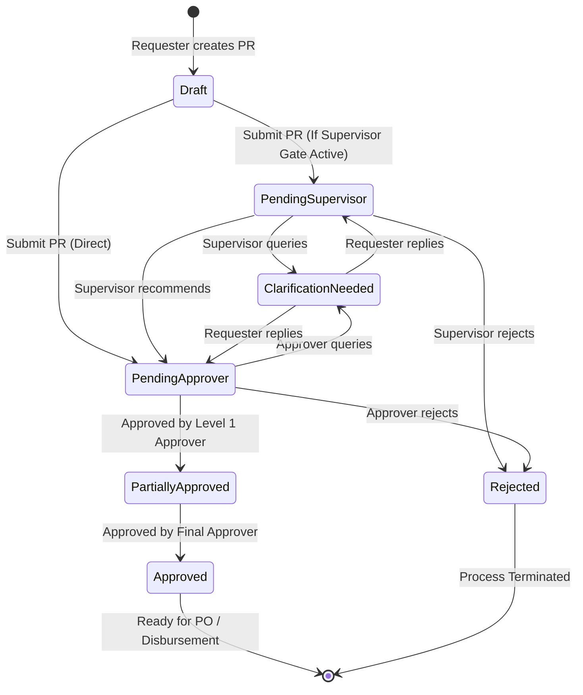

# PurchaseTracker — Enterprise Procurement & Vendor Management System
## Comprehensive User Manual by User Role

---

## Table of Contents
1. [System Overview & Architecture](#1-system-overview--architecture)
2. [Role Hierarchy & Permission Matrix](#2-role-hierarchy--permission-matrix)
3. [User Type 1: Standard Employee / Requester (`user`)](#3-user-type-1-standard-employee--requester-user)
4. [User Type 2: Department Supervisor / Stage-1 Reviewer (`supervisor`)](#4-user-type-2-department-supervisor--stage-1-reviewer-supervisor)
5. [User Type 3: Department Head & Approver (`approver`)](#5-user-type-3-department-head--approver-approver)
6. [User Type 4: Administrator / Finance Admin (`admin`)](#6-user-type-4-administrator--finance-admin-admin)
7. [User Type 5: Super Administrator (`super_admin`)](#7-user-type-5-super-administrator-super_admin)
8. [User Type 6: External Vendor (Self-Service Portal)](#8-user-type-6-external-vendor-self-service-portal)
9. [Purchase Request (PR) Lifecycle & Workflow States](#9-purchase-request-pr-lifecycle--workflow-states)
10. [PWA Offline Support, Sync & System Maintenance](#10-pwa-offline-support-sync--system-maintenance)

---

## 1. System Overview & Architecture

**PurchaseTracker** is an enterprise-grade procurement, approval orchestration, and vendor compliance management platform designed for multi-departmental operations.

### Key Capabilities:
- **Purchase Request (PR) Workflow Engine**: Supports multi-stage hierarchical approvals, department head gates, multi-currency conversion to Qatari Riyals (QAR), itemized line-item management, and flexible payment milestone structures (Advance, In-Parts, Post-Project).
- **Dynamic Vendor Compliance Engine**: Automated ruleset-driven compliance assessment calculating real-time vendor risk scores (0–100%), document expiry tracking, and two-stage banking verification.
- **Vendor Self-Service Onboarding**: Secure, tokenized onboarding portal allowing external vendors to submit company profiles, banking credentials, and compliance documents directly without requiring corporate accounts.
- **Enterprise Security & Audit**: Role-Based Access Control (RBAC), immutable transaction logging, dual-custody banking detail revelation, and strict rate-limiting.
- **Progressive Web App (PWA)**: Full mobile & desktop offline resilience with one-click **Sync & Refresh** and automated background update delivery.

---

## 2. Role Hierarchy & Permission Matrix

| Capability / Module | Requester (`user`) | Supervisor (`supervisor`) | Approver (`approver`) | Admin (`admin`) | Super Admin (`super_admin`) |
| :--- | :---: | :---: | :---: | :---: | :---: |
| **Create Purchase Request** | ✅ | ✅ | ✅ | ✅ | ✅ |
| **Track Own Department PRs** | ✅ | ✅ | ✅ | ✅ | ✅ |
| **Stage 1 (Supervisor Gate) Review** | ❌ | ✅ | ❌ | ✅ | ✅ |
| **Approve / Reject Department PRs** | ❌ | ❌ | ✅ | ✅ (if assigned) | ✅ (All Depts) |
| **Request Clarification on PR** | ❌ | ✅ | ✅ | ✅ | ✅ |
| **Revoke Approved PR Decision** | ❌ | ❌ | ❌ | ❌ | ✅ |
| **Vendor Quick-Create** | ✅ | ✅ | ✅ | ✅ | ✅ |
| **Copy Vendor Compliance Link** | ✅ | ✅ | ✅ | ✅ | ✅ |
| **Revoke Vendor Active Tokens** | ❌ | ❌ | ❌ | ❌ | ✅ |
| **Stage 1 Banking Verification** | ❌ | ❌ | ❌ | ✅ (Finance) | ✅ |
| **Stage 2 Banking Verification** | ❌ | ❌ | ❌ | ❌ | ✅ |
| **Reveal Masked Banking Details** | ❌ | ❌ | ❌ | ❌ | ✅ (With Audit) |
| **Compliance Override Approval** | ❌ | ❌ | ❌ | ❌ | ✅ |
| **Grant Grace Period to Vendor** | ❌ | ❌ | ❌ | ✅ | ✅ |
| **User & Role Administration** | ❌ | ❌ | ❌ | ✅ (Basic) | ✅ (Full) |
| **Department Structure & Budgets** | ❌ | ❌ | ❌ | ❌ | ✅ |
| **Ruleset Versioning & Governance** | ❌ | ❌ | ❌ | ❌ | ✅ |
| **Database Backups & Diagnostics** | ❌ | ❌ | ❌ | ❌ | ✅ |

---

## 3. User Type 1: Standard Employee / Requester (`user`)

### 3.1 Primary Responsibilities
Standard employees create purchase requests for goods, services, or capital expenditures required for operational projects, link accredited or new vendors, and track requests through the approval pipeline.

---

### 3.2 Dashboard & Navigation
Upon logging in, the **Requests Dashboard** displays:
- **My Requests**: All PRs submitted by you or within your primary assigned department.
- **Status Pills**: Quick counts of Drafts, Pending Approval, Partially Approved, and Approved requests.
- **Top Actions**: **+ New Purchase Request**, **Search**, and **Sync & Refresh**.

---

### 3.3 Creating a Purchase Request (Step-by-Step)

#### Step 1: General Details
1. Click **+ New Purchase Request** in the top navigation or requests header.
2. **Request Title**: Enter a clear, descriptive title (e.g., `Q3 Event Production Audio-Visual Staging`).
3. **Submitting Department**: Defaults to your assigned department (users with multiple department assignments can toggle their target department from the dropdown).
4. **Purpose Category**: Choose the financial purpose classification (e.g., `FEC`, `Marketing Operations`, `Facilities`).
5. **Project / Lifecycle**: Select the corresponding sub-purpose or project lifecycle. The allocated budget for that sub-purpose will display automatically.
6. **Priority**: Set to `Low`, `Medium`, `High`, or `Urgent`.

#### Step 2: Vendor Selection & Compliance
1. **Choose Vendor**: Select a registered vendor from the searchable dropdown.
   - The badge displays the vendor's real-time **Compliance Score** (e.g., `100% Compliant` or `Under Review`).
2. **Quick-Create Vendor** (If vendor is not in catalog):
   - Click the **Quick-Create Vendor** button.
   - Enter **Company Name**, **Contact Person**, **Email Address**, **Phone Number**, and **Currency**.
   - Click **Save & Continue**. The new vendor is automatically selected in your PR.
3. **Copy Compliance Link**:
   - If the vendor needs to submit documents or update bank details, click **Copy Compliance Link**.
   - Share this secure 7-day link directly with the vendor via email or messaging.

#### Step 3: Items & Multi-Currency Pricing
1. **Currency**: Select transaction currency (`QAR`, `USD`, `EUR`, `AED`, `CNY`). The system automatically converts the estimated total to QAR using live exchange rates.
2. **Line Items**: Click **+ Add Item** to enter:
   - **Item Name / Description**: Specific description of goods/services.
   - **Quantity**: Numerical quantity.
   - **Estimated Cost per Unit**: Cost in selected currency.
3. **Freight / Shipping Amount**: Enter any ancillary shipping or handling costs.
4. **Total Estimated Exposure**: Real-time sum displayed prominently in QAR.

#### Step 4: Payment Milestone Structure
Select the disbursement arrangement agreed upon with the vendor:
- **Post Project (Default)**: 100% payment upon delivery and project sign-off.
- **Advance Payment**: 100% upfront settlement prior to project commencement.
- **In Parts (Milestones)**: Define custom percentage or fixed-amount tranches (e.g., `30% Mobilization`, `40% Mid-delivery`, `30% Final Retention`). The cumulative allocation must equal 100%.

#### Step 5: Document Attachments & Submission
1. Drag and drop vendor quotations, technical specifications, or rate cards (PDF, JPG, PNG up to 10MB).
2. Review the summary on the right-hand drawer.
3. Click **Submit Purchase Request**.

---

### 3.4 Responding to Clarification Requests
If an approver requires more information:
1. You will receive an immediate in-app and email notification.
2. Open the request from your dashboard (flagged with a yellow **Clarification Needed** badge).
3. Scroll to the **Workflow & Approvals** section.
4. Type your reply in the clarification box, attach any requested documents, and click **Submit Response**.
5. The request automatically returns to the approver's active queue.

---

### 3.5 Printing & Exporting PRs
Open any approved or pending request and click **Download PDF** or **Print Summary** in the top-right menu to obtain the official timestamped purchase order document.

---

## 4. User Type 2: Department Supervisor / Stage-1 Reviewer (`supervisor`)

### 4.1 Primary Responsibilities
Supervisors act as the first-line quality gate for their department. They ensure that all requests created by team members have valid business justification, accurate cost projections, and complete documentation before escalating to Department Heads or Finance.

---

### 4.2 Supervisor Review Workflow

1. **Accessing the Review Queue**:
   - Navigate to `/dashboard/requests` and select the **Pending Supervisor Review** filter.
2. **Inspection Checklist**:
   - **Business Justification**: Verify the request description aligns with department deliverables.
   - **Line Items & Cost Accuracy**: Validate that quantities and unit costs reflect competitive vendor quotes.
   - **Vendor Status**: Check if the vendor has uploaded required compliance documentation.
   - **Attachments**: Ensure at least one official vendor quotation is attached.
3. **Executing Decisions**:
   - **Pass to Approver (Recommend)**: Click **Approve Stage-1 Gate**. The PR transitions to `pending_dept_head` or `pending` for formal fiduciary approval.
   - **Request Clarification**: If quotes are missing or details are unclear, click **Request Clarification**, type the specific deficiency, and send it back to the requester.
   - **Reject**: If the purchase is unauthorized or redundant, click **Reject Request** and provide a mandatory explanation.

---

## 5. User Type 3: Department Head & Approver (`approver`)

### 5.1 Primary Responsibilities
Department Heads and accredited approvers hold fiduciary responsibility for authorizing expenditures against departmental budgets and purpose allocations.

---

### 5.2 Approvals Queue & Filtering
In the **Requests** view, approvers have access to specialized filters:
- **Needs My Approval**: Displays requests where your specific department or approval level is currently pending.
- **Department Requests**: All requests across your assigned departments.
- **High Exposure**: Requests exceeding departmental baseline thresholds.

---

### 5.3 Step-by-Step Approval Walkthrough

1. Open the pending request from the queue.
2. **Review Header Metrics**:
   - **Total Cost in QAR**: Review the converted total exposure.
   - **Purpose Budget Utilization**: Check the allocated budget vs. spent budget meter for the linked purpose.
   - **Vendor Compliance Tier**: Green (100%), Yellow (Grace Period / Non-Critical Missing), or Red (Non-compliant).
3. **Inspect Line Items & Payment Schedule**:
   - Review milestone due dates and percentages in the **Payment Breakdown** tab.
4. **Take Action**:
   - **Approve**: Click **Approve Request**. Confirm your decision in the modal.
   - **Reject**: Click **Reject**. You must input a detailed reason (e.g., `Exceeds Q3 Marketing budget envelope`).
   - **Request Clarification**: Click **Ask for Clarification** to query the requester without rejecting the PR.
5. **Bulk Approvals**:
   - From the main table, check multiple pending requests and click **Bulk Approve Selected** in the floating batch action bar.

---

## 6. User Type 4: Administrator / Finance Admin (`admin`)

### 6.1 Primary Responsibilities
Administrators oversee cross-departmental operations, vendor accreditation, Stage-1 finance banking reviews, account onboarding, and organizational reporting.

---

### 6.2 Vendor Directory & Accreditation Management
Navigate to `/dashboard/vendors`:
- **Vendor Overview**: View compliance scores, document counts, banking verification status, and active PR count.
- **Compliance Link Dispatch**: Click **Generate Compliance Link** to create a fresh 7-day tokenized portal link for any vendor.
- **Grace Periods**: If an essential vendor has an expiring Commercial Registration (CR), click **Grant Grace Period** (up to 30 days) with a recorded justification to prevent operational bottlenecks.

---

### 6.3 Stage-1 Banking Verification (Finance Admin)
When a vendor submits new banking credentials via the self-service portal:
1. Navigate to `/dashboard/admin/vendors` and select the **Banking Verification** tab.
2. Inspect the submitted **Bank Name**, **IBAN**, **Account Number**, and attached **Bank Certificate / Stamped Letter**.
3. Click **Approve Stage-1 (Finance Verification)**.
4. The record moves to `pending_stage2` for final Super Admin authorization.

---

### 6.4 Master Catalog & Account Administration
- **User Account Requests**: Navigate to `/dashboard/admin/account-requests` to approve or reject pending employee registrations and assign starting departments.
- **Items Catalog**: Maintain standard pricing and descriptions for recurring company supplies.
- **Financial Reporting & Bundles**: Navigate to `/dashboard/admin/analytics` to export the master procurement ledger to Excel or generate full audit PDF bundles.

---

## 7. User Type 5: Super Administrator (`super_admin`)

### 7.1 Primary Responsibilities
Super Admins possess root-level authority over system configuration, user privileges, departmental freeze states, compliance ruleset versioning, sensitive credential access, and executive workflow overrides.

---

### 7.2 System Governance & User Access Control
Navigate to `/dashboard/admin/users`:
- **Role Assignment**: Assign roles (`user`, `supervisor`, `approver`, `admin`, `super_admin`).
- **Multi-Department Access**: Configure `assignedDepartments` for cross-functional approvers.
- **Department Freezing**: If a department undergoes a budget audit, toggle its status to **Frozen**. Frozen departments cannot create or approve new requests until unfrozen.

---

### 7.3 Dynamic Compliance Ruleset Engine
Navigate to `/dashboard/compliance`:
- **Configure Rule Definitions**:
  - Define rules for Commercial Registration (CR), Tax Cards, Establishment Cards, QID, and NDAs.
  - Set input types (`document`, `field_and_document`, `date`, `dropdown`).
  - Configure scoring weights and whether missing items block PR approvals.
- **Version Snapshotting**: Click **Publish New Ruleset Version** to compile active rules into an immutable version snapshot (e.g., Version 2.0).

---

### 7.4 Two-Stage Banking Verification & Sensitive Data Access
1. **Stage-2 Final Verification**:
   - Navigate to `/dashboard/admin/vendors` -> **Banking Staging**.
   - Review Stage-1 approved banking records.
   - Click **Authorize Stage-2 (Super Admin)** to permanently update the vendor's production payment records.
2. **Reveal Masked Banking Details**:
   - In any vendor profile, banking numbers are masked for security (`•••• •••• •••• 4012`).
   - Click **Reveal Full Details**. An immutable security audit log entry is written with your User ID and timestamp.

---

### 7.5 Compliance Overrides & Workflow Revocations
- **Compliance Override Approval**: If a critical purchase must proceed with a non-compliant vendor, the Super Admin can review and approve a formal **Compliance Override Request**.
- **Approval Decision Revocation**: If an approval was submitted in error, Super Admins can revoke the decision on any approved PR and return it to pending status.
- **Revoke Active Vendor Links**: Immediately terminate active portal tokens for any compromised or suspended vendor.

---

### 7.6 Backups & System Diagnostics
- **Automated Neon Database Backups**: Navigate to `/dashboard/admin/backups` to inspect daily automated backups or trigger on-demand snapshots.
- **System Diagnostics**: Monitor API latency, R2 storage connectivity, and rate-limiting metrics.

---

## 8. User Type 6: External Vendor (Self-Service Portal)

### 8.1 Overview & Access
Vendors access the secure **Vendor Self-Service Portal** (`/vendor/portal`) via a one-time 7-day token link shared by the procurement team. **No username or password is required.**

---

### 8.2 Self-Service Onboarding Wizard (Step-by-Step)

```
+-----------------------------------------------------------------------------------+
|                            VENDOR SELF-SERVICE PORTAL                             |
|                                                                                   |
|  [Step 1: Company Profile] -> [Step 2: Banking Details] -> [Step 3: Documents]   |
|                                          |                                        |
|                                          v                                        |
|                           [Step 4: Review & Submit]                               |
+-----------------------------------------------------------------------------------+
```

#### Step 1: Organization Profile
- **Company Legal Name**: Official registered entity name.
- **Contact Information**: Primary contact person, email address, phone number, and physical office address.
- **Registration Identifiers**: Commercial Registration (CR) Number and Tax / VAT Identification Number.

#### Step 2: Banking & Financial Credentials
- **Bank Name & Branch**: Primary corporate banking partner.
- **Account Number & IBAN**: Complete international bank account number for electronic wire transfers.
- **Settlement Currency**: Agreed payment currency (`QAR`, `USD`, `EUR`, `AED`, `CNY`).

#### Step 3: Compliance Document Gateway
- The portal displays a clear checklist of required and optional documents:
  1. **Commercial Registration (CR)** *(Mandatory — Must input expiry date)*
  2. **Tax Card / VAT Certificate** *(Optional / If applicable)*
  3. **Establishment Card / Computer Card** *(Optional / If applicable)*
  4. **Company Profile / Brochure** *(Optional)*
- **Upload Method**: Drag and drop PDF, JPG, or PNG files (up to 10MB per file).
- Files are uploaded directly and scanned for format validity.

#### Step 4: Review & Digital Declaration
1. Review all entered data in the consolidated summary card.
2. Check the **Legal Declaration**:
   > *"I hereby declare that all submitted company information, banking credentials, and uploaded compliance documentation are accurate, current, and authorized for electronic payment and business registration."*
3. Click **Submit Profile for Verification**.
4. The portal switches to the **Submitted & Under Review** screen. The procurement and finance teams are automatically notified to initiate verification.

---

## 9. Purchase Request (PR) Lifecycle & Workflow States



### State Definitions:
- **`draft`**: Editable only by the author. Not visible in approval queues.
- **`pending_dept_head` / `pending_supervisor`**: Initial departmental review gate.
- **`pending`**: In active multi-level approver queue.
- **`partially_approved`**: Authorized by initial department head; awaiting secondary or finance approval.
- **`approved`**: Fully authorized. PDF purchase order generated.
- **`rejected`**: Disapproved. Requester notified with feedback.
- **`cancelled`**: Revoked by requester or Super Admin.

---

## 10. PWA Offline Support, Sync & System Maintenance

### 10.1 Progressive Web App (PWA) Features
PurchaseTracker functions as a full Progressive Web App on mobile (iOS Safari, Android Chrome) and desktop (macOS Chrome/Edge, Windows):
- **Home Screen Installation**: Click **Install App** in the browser address bar or mobile share sheet.
- **Offline Mode**: View previously loaded purchase requests, catalog items, and draft details even when disconnected from the internet.

### 10.2 Manual Sync & Cache Refresh
If an update is deployed or connection is restored after offline work:
1. Click the **Sync & Refresh** button (circular arrows icon) in the top navigation bar or mobile menu.
2. The service worker clears stale cache entries, polls the server for new notifications and request state changes, and instantly updates the UI without requiring a full browser restart.

---

*PurchaseTracker Enterprise Procurement Hub — Documentation Version 2.0*
